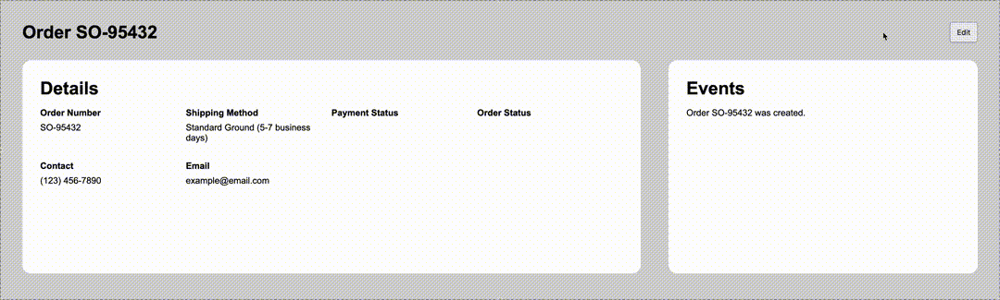

# Horse Race

This is a feature demo I made showcasing field update events. Field update events is part of an events logs that helps to document changes.

This uses a simple detail page for a mock Order. The page has a Details section and an Events section. The Order info can be updated using the Edit button found in the top-right. When updated, each field that has changed will create a `FieldUpdateEvent` and add that event to the Events section.

## How to run

In the project directory, run `npm install` then `npm start`.

Open [http://localhost:3000](http://localhost:3000) to view it in your browser.
