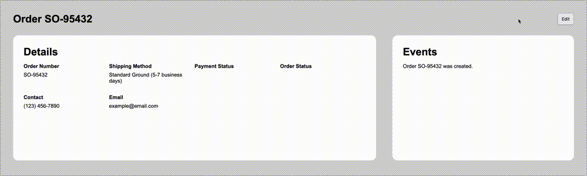

# Field Update Events

This is a feature demo showing field update events. Field update events are part of an event log system that tracks and documents changes.

This uses a detail page for a mock order transaction. The page includes a Details section and an Events section. Order details can be edited using the Edit button. When updates are made, each changed field generates a FieldUpdateEvent, which is then added to the Events section.

## How to run

In the project directory, run `npm install` then `npm run dev`.

Open [http://localhost:5173](http://localhost:5173) to view it in your browser.